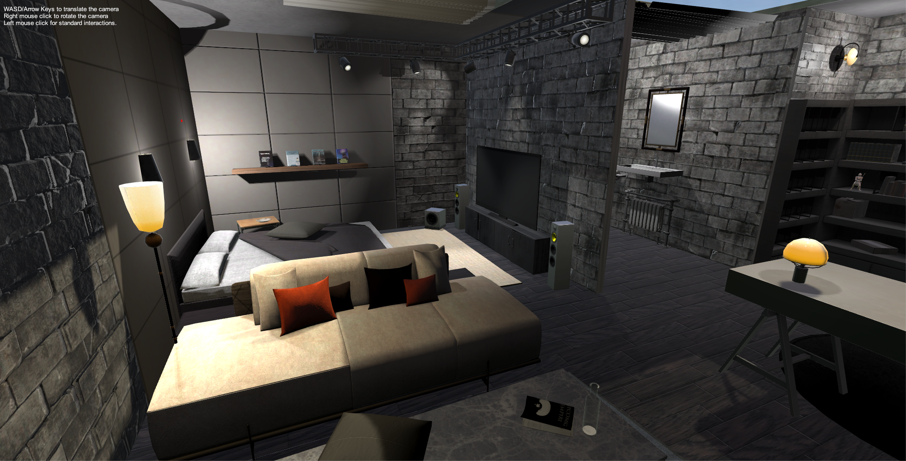
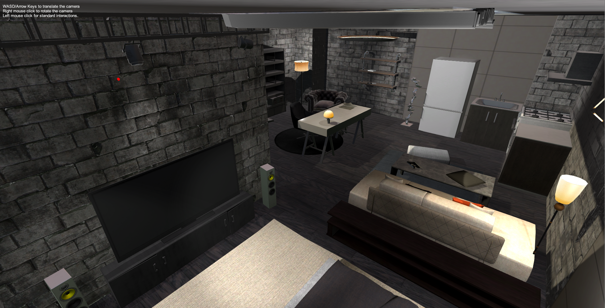
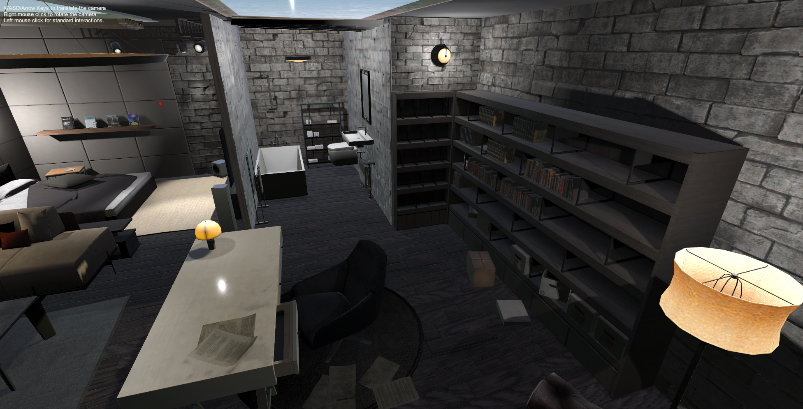
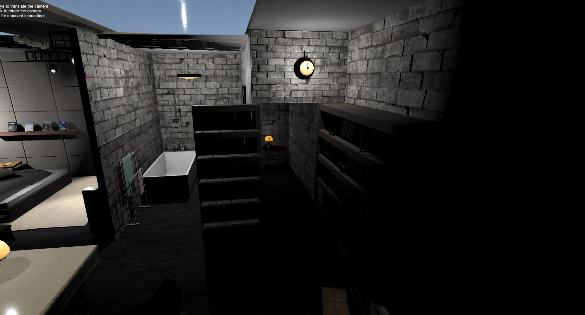
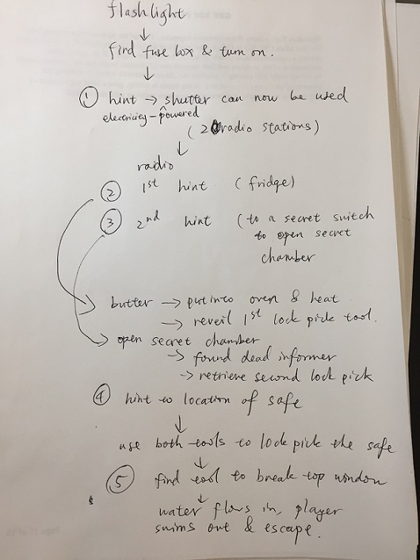
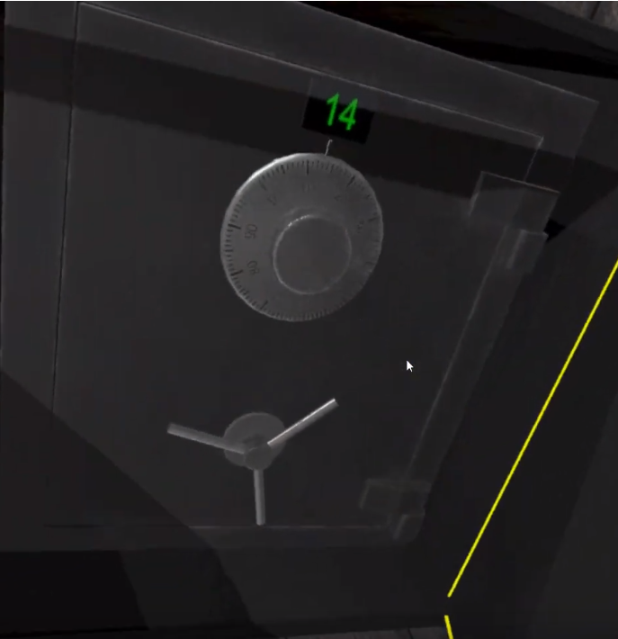

VR ESCAPE ROOM
=============================
Team 2 - Qian Yan, Yifan Xu, Jiwen Wu, Yexiang Shao

## PRD
For more detailed and updated design, please see our [PRD](https://docs.google.com/document/d/1rcIkcjQwjiIJ1NvRoKyZVYqxz6zIwUgDSnxbGwEAvUE/edit?usp=sharing) (Accessible with UW email). 

## Abstract
This gives a preview of our team's course project and the ultimate goal we wish to achieve by the end of the quarter. This project is designed so that everyone in the team can have something different to work on concurrently and learn various features provided by Unity framework. At the mean time, we also want the project to be interesting, not only yielding a result that is amazing to be played with, but also having a developing process that is enjoyable to us.

## Introduction
For the final project of this course, we are planning to work on creating an escape room VR game. It will be a single player game in which the player is confined in a limited game space filled with interactable game components.

Just like a typical escape room experience, in this confined game space, which probably will be an office, a living room, etc., player will be able to interact with all sorts of furnitures and electronics to find clues, solve puzzles and eventually get out of the room. But what special in this game is that we will fully utilize the power of VR to really give the player an immerse gaming experience like they are playing an escape room in the real life; actually even better with the environment we will be able to create freely with Unity.

For the gameplay, on top of the ordinary "search and find", we plan to have (at least) three core puzzles that distinguishes our game from the other game. They are illustrated in more details below.

## Story line, Narrative
Detective Johnson is tracing a mysterious death of an old millionaire. That was a rainy day, and he was trying to rendezvous with one of his undercover informer near one of the millionaire’s old chalet. Fifteen minutes have passed the agreed meeting time, but the informer still has not shown up yet. Detective Johnson kept waiting...thirty minutes...one hour...until he has lost track of time… Suddenly, he was hit on the back of the head! Detective Johnson lost his consciousness…

When he woke up, he found himself in a dark room. Johnson realized that his hands were cuffed, and not only that, the room is located underwater, and water is filling up the room quite fast! Johnson will have to hurry now….. He needs to gather information from the room to find out the whereabouts of his undercover informer, and find a way to escape the room before the room is completely filled with water!

## Components
### Environment
This is the play ground of the game, the room our player is trapped in. To increase the immersiveness of the game, we want to make it real. This room will be filled with interactly components, like furnitures, decorations and electronics just like a real room.

Most of these components will just be there so that the player will be able to play with and move around to increase the reality of the environment and give the player a basic idea on what kinds of interactions are allowed in this environment. Some hints & clues will also be hidden with these components.

Other components in the environment will be used to reveal the story line and give the player the some information of the environment they are trapped in to increase the imersiveness. For example, instead of giving the player the background of the owner of the house directly through narrative, we can put them on a letter on the table so players can explore it by themselves. Another example will be a window in the room to reveal some of the view outside and raindrops on the window to match the possibly heavy rain background music.

### Player movement
In our game, player will only being able to move like a human using the controller, not through any teleportation which can ruin the immersiveness of the game making it feel unreal.

### Puzzles
#### Flash Light Puzzle
In this game, we want to explore the effect of the limited vision to increase the imersiveness and the thrill of the game. Player will initially only be able to explore the environment through the flash light until they find the switch of the light.

More over, one of the puzzle in the game will be related to the flash light. To solve this puzzle, player needs to turn off the light to see the hints that will be invisible if light is on.

#### Radio Puzzle
Radio Puzzle is basically simulating operating radio devices such as telegraph machines and some other normal radio devices. The expected design would be let the player operate these devices given a hint and find something to get out of the escape room. For example, a player would swtich to and hear from FM 105.3 to gather hints, but it could be more complex than this. The significance of this puzzle is about designing and creating radio devices, and the context could be situated at when world wars happened, as a soldier is trying to send or receive messages with a telegraph machine.

#### Lockpicking
In this puzzle, we want to simulate picking a lock. This will both be a scene in the escape room game, and an educational tutorial too, as lock picking is actually not that easy in real life and we would like to give player a chance to experience lock picking in this game. Controlling lock picking tools with VR controllers can be challenging, so we are thinking of creating a very big lock and big lock picking tools to make things easier. Hopefully, players will be able to pick a lock in real life after playing our game a few times!
## Goal
### Week 2
- [ ] A simple work space with work benches
- [ ] Player & Player Movement
### Week 3 & 4
- [ ] Game environment set up
- [ ] Player & Player Movement
- [ ] Placing simple interactable objects
- [ ] Some hints placed to make the game playable
- [ ] Start working on three core puzzles
### Week 5 & 6
- [ ] More elements/decorations to the game
- [ ] Continue working on core puzzles
- [ ] Increase the difficulty of the game by placing more hings and interactable objects
### Week 7
- [ ] Finish the game logic
- [ ] Ready for midterm project presentation
- [ ] Demo and Minimal playable game
### Week 8 & 9
- [ ] Finish three core puzzles
- [ ] Increase user experience
- [ ] Work on strech goal
### Week 10
- [ ] Prepare for Demo and Final presentation

## Strectch Goal
- [ ] Give better texture to game elements

## Product Requirements Document
[PRD](https://docs.google.com/document/d/1rcIkcjQwjiIJ1NvRoKyZVYqxz6zIwUgDSnxbGwEAvUE/edit?usp=sharing) (Accessible with UW email)

## Blog Post

### Requirement
- What every member did this week
- Update on code, links to relevant code added this week
- Update on ideas (current demo result: embed video and/or screenshot)
- Plan for next week (for every team member)
- Blocking issues, help needed

### Week 1

This week all the group members did Unity tutorial and experienced with some VR/AR devices available for our capstone projects. We also brainstormed our project ideas individually. The tentative project ideas we have are: 

- [ ] making pottery on VR
- [ ] AR/VR drum game
- [ ] VR escape room
- [ ] ...

We evaluated the feasibility of each idea individually and our plan for next week is to discuss our ideas together and hopefully finalize our project.

### Week 2

This week we learned ARcore tutorial and started to discuss our project ideas together. Create team webpage. We listed the pros and cons of our topics and evaluated them. We also did some research on existed projects that are similar to our ideas. 
We found the projects like [VR pottery](https://store.steampowered.com/app/992610/Lets_Create_Pottery_VR/), [Drums Hero](https://store.steampowered.com/app/608370/Drums_Hero/), etc. 
Therefore, we chose to develop a VR escape room with some creative features for our project. After finalizing our project, which is an escape room VR game, we wrote a proposal for it and filled the webpage with our initial project design.
Our plan for next week is to present our project design to the class and start setting environment for our project. After getting familiar with the device we are going to use, we also want to build some initial settings for our project next week.

### Week 2

Potential Environment

- https://assetstore.unity.com/packages/3d/environments/urban/old-brick-house-94243
- https://assetstore.unity.com/packages/3d/environments/fantasy/medieval-cartoon-furniture-pack-15094
- https://assetstore.unity.com/packages/3d/environments/modern-archviz-leafless-108308

Furnitures
- https://assetstore.unity.com/publishers/2284?orderBy=popularity&page=2&plusPro=false&price=0-4000&rating=0&released=0

Flashlight

- https://assetstore.unity.com/packages/3d/props/electronics/flashlight-18972

Radio

- https://assetstore.unity.com/packages/3d/props/electronics/retro-radio-76817
- https://assetstore.unity.com/packages/3d/props/electronics/vintage-radio-pack-27734

Lockingpicking
- https://assetstore.unity.com/packages/3d/props/tools/mini-pack-lockpick-kit-80028

Sample project

- https://github.com/yinsimei/Escape_2016/tree/master/Assets
- https://www.youtube.com/watch?v=lnSwbf05Kxs&index=3&list=PL8BNwwCeojJ5MDnWPpv-lB1OdrQIG3B7N

Gun Pack

- https://assetstore.unity.com/packages/3d/props/guns/modular-gun-pack-85412
- https://assetstore.unity.com/packages/tools/input-management/vr-weapon-interactor-64080
- https://assetstore.unity.com/packages/3d/characters/animated-marksman-pack-108515

Interactable Objects

- https://assetstore.unity.com/packages/3d/extreme-interactable-pack-81536
- https://assetstore.unity.com/packages/3d/characters/3d-animated-book-67997
- https://assetstore.unity.com/packages/3d/props/classic-typewriter-125655
- https://assetstore.unity.com/packages/3d/props/scattered-paper-debris-74192

Breakable Containers

- https://assetstore.unity.com/packages/3d/props/furniture/breakable-objects-system-addon-2-131534
- https://assetstore.unity.com/packages/3d/props/breakable-objects-system-addon-1-131194
- https://assetstore.unity.com/packages/3d/environments/dungeons/breakable-objects-system-addon-3-131692
- https://assetstore.unity.com/packages/3d/props/breakable-medieval-containers-116612

Arms

- https://assetstore.unity.com/packages/tools/visual-scripting/visual-interaction-55228
- https://assetstore.unity.com/packages/tools/animation/full-arms-vr-ultimate-interaction-toolset-102839

### Week 3

On Tuesday, we presented our project in front of the class and absorbed many creative ideas and suggestions from our instructors, TAs and classmates. One important thing is to make our escape room distinct from the others. For example, we could put some objects in our game that are not easily accessible in the real life, such as laser guns, make elements flow around and put our room on a plane or a ship. There were also several questions raised; we will have a 5-minute demo at the end so we should leverage the length and difficulty of the game and maybe give some hints when players need them. Moreover, it is significant to decide how players move in the game (teleport vs. actually walking), and we are stilling testing this.

On Thursday, Qian was setting up the environment and we together were looking for assets that we could make use of, as listed above. Basically, we have set up a terrain and a big house for our escape rooms and other VR headset stuff. Actually, we spent a lot of time testing out which asset is usable and suitable. However, we are not sure what to put into our Git (maybe just scripts and things we created?) because those assets could be as large as several gigabytes. 

We had also decided several things:

- There are some "lockpicking" assets already, so we could import and customize them by ourselves.
- There are no interactive Radio assets in the store, so we decided to make use of only the models and appearance and then to add some dials and buttons along with some scripts to make them interactive.

A suggestion from our TAs is to settle down the overall game logic first and then add other game components, such that each week we could at least have a running version for people to try and test and we could fix bugs or adjust the difficulty correspondingly.

We have also added a section in the website for PRD as shown above.

For the next week, we plan to “shrink” that big house into a single room that is going to be our escape room, finalize the environment(to put the room in a ship or a plane and set up weather and lights), have all basic, usable assets ready(e.g. interactive radios) and finishing up player's movement(teleport vs. actually walking). 

### Week 4
This week, we finished setting up our main game environment--the room we need to escape from. We have placed many furniture, a secret chamber, light sources, texture for both the walls of the room and the floor, and many other decorations.

Here are some screenshots:

We decided to implement teleporting instead of actually walking around, as after careful testing, teleporting provides better user experience. We have added the teleporting plane to the room, and everywhere in the room that is not blocked by objects are now teleportable.

We also greatly modified our storyline and setting, created a game flow plan on how the puzzles are linked together, and updated our PRD to reflect these changes. Now, the escape room is underwater and water is filling up the room, and the player will need to find a way to get out of the room before the room is completely filled with water. We have finalized the locations of our puzzles and hints.

*our Game Flow*

Since radios found in the asset store are not interactable (the frequency knob cannot be turned), we kept digging in the asset store and found an interactable set of knob, lever, and button. We also did research on how to script the interaction of openning/closing the shutters, turn on/off lights, and firing a gun (potential way of breaking the roof window).

For next week, we plan to get most of the puzzles working and interactable (the lock picking puzzles could be complicated and might require extra time). For instance, shutter can now be open/close as user is adjusting the position of a lever, lights can be turned on/off after the master switch is on, refrigerator and oven can be open/closed correctly, etc. Also, we will experiment with adding the effect of the room being underwater (maybe user can see fish swimming from the roof windows), and water filling into the room.

### Week 5
This week, we have devided our work among the four of us. We will each focus on one aspect/puzzle of the game.
- Qian Yan: Work on further improving the game scene and add scripts to make furnitures interactable. Here are the summary of the goals achieved:
  - Greatly improved the lighting of the game scene - the scene now looks more "real" and actually has better performance than before with the lightings in the room.
  - Many stuffs like pillows and scattered papers can now be interactable in a simple way.
  - The drawers of the desk now can be pull out and pull in with a linear movement script.
    
  - The fridge doors can now be open/closed with a circular script motion.
    
    
  - The secret door now has an open/close animation triggered with a button press.
    
 
- Jiwen Wu & Yexiang Shao: We worked on several interactive parts of the room:
  - The shutter on the ceiling that covers the roof windows can now be openned/closed with a press of a button, using animations and Unity's animator class. As we are going to hide a hint on the roof window, the player will need to open the shutters in order to see the hint: (Click on the picture to see a demo)               
   
  - The radio is now fully functional: the tuning knob is working properly, and when switched to different frequencies, different audio will be played, including the hints. This took quite some time, because of Unity's complex Quaterion system returns weird angles. We made the radio tuning knob work after using the circular drive script instead. (Click on the picture to see a demo)                                                         
  
  - Implemented a flashlight that is able to be switched on/off (no demo is included because we are going to switch to a new flashlight prefab). In addition, we figured out how to turn on/off any light.
  
- Yifan Xu: Work on developing a gun that can break the windows to escape the room
  - A delicate model of gun can be picked up by the users by grabbing the grip
  - After being picked up, the gun will attach to the controller until the grip is grabbed again
  - User can fire the gun by grabbing the pinch. In current state, a light effect, a gunshot sound and a fire animation will launch but no bullet will come from the gun.
  - A breakable window which will break into pieces after detecting a collision is ready to be placed.
  
  
Plans for next week:
- Qian Yan: will work on the oven hint.
  - figure out how to hide the tool in an ice cube
  - implement a functional oven that can be turned on/off
  - implement the effect of ice melting, so that after a period of time, the ice completely melts and the player will be able to retrieve the tool
  - figure out how to detect when the oven tray holding the ice cube is placed into oven, and after certain time, the ice melts and the tools will be reveiled.
  = figure out the collision models of the ice cube / tool / oven / oven tray.

- Jiwen Wu & Yexiang Shao:
  - work on a functional fuse box, which will give electricity to the room and then every light/appliance will be able to function.
  - work on a implementing a safe. Try to add some sort of a password system.
  - decorate the room further more -- for instance, put beer/drinks into the fridge, oven trays in cabinet, put real-life switches in the room to control light and shutter (instead of the current simple button), etc.
  
- Yifan Xu:
  - continue working on the effects of gun and breakable window, including:
    - determine the direction and path of the bullets
    - break the windows when it's "shot".
  - drop some hints in the scenes by writing them on papers hidden in the breakable objects.
  - enrich the storyline by placing an animated book that narrates the story in the scene.
  
### Week 6
We have finished our MVP! Here is a video of our MVP:

- Yexiang Shao
  - Worked on radio dial and safe box mechanism, and integrated them into our main scene.
  - Radio dial
    - Added more audio sources to the radio to give players more hints and helped process the game. Last week, we already had two audios. One is the noise and the other is a commercial suggesting that there is a key inside the freezer. This week, I added a breaking-glass sound to bring up another hint which the player should use the gun to shoot the window.
  - Safe box
    - I also added a safe box whose function is to store that gun. The mechanism has four main parts:
      - A knob for players to input a number from 0-99.
      - A small monitor to display what number the player chooses.
      - A handle that could be rotated only when the number is correct.
      - A door that could be opened only when the handle has been rotated 280 degree.
    
    
- Jiwen Wu
  - Worked on the mechanism for the fuse box, and integrated it to our main scene
    - there are three switches and one button in the fuse box. All are interactable: only when all three switches are on the top position, and the user presses the button, will all the lights be turned on. When al three switches are down and the user presses the button, all lights will go off.
    - made the fuse box cover to be openable.
  - Worked on the positions of the shutters and improved the sensibility of the buttons that control the shutters.
  - Decorated the main scene with more items.

- Yifan Xu
  - Worked on the gun and the breakable glasses, and integrated them into the main scene.
    - created a bullet instance to be shot when users fire the gun
    - determined the direction and path of the bullets
    - break the windows when it's "shot"
    - allowed the users to shoot the gun in the scene and when the bullet hits the window, it will break into parts and fall down suddenly.
    

- Qian Yan
  - For this week, I finished the plan from last week - the oven puzzle. The key hidden inside the ice cube will be revealed once heated inside the oven.
  - On top of that, I implemented a new secrete-door-open mechanism - the musicbox in the scene and the animation along with it.
    - The musicbox will play once the key is inserted into the keyhole and the handle is turned. At the same time, the door will open & close when the tune finishes.
    - To incorperate this, another secrete open-key is also added to the inside of the secrete the room. Player can open the door again from inside by pushing one of the bricks on the wall.
  - Link the Jiwen's fuse box piece to the lightings in the room: this includes the lights and the emissive materials; so they are turned off properly.
    - A flashlight is also added to the scene and tuned to stay in the hand in a reasonable way.
  - Heavy work on the game scene:
    - rework on room's lighting:
      - a new baked lightmap switcher script is included so the baked lightmap gets switched between our light-on lightmap to light-off one with the fuse box to make the scene completely dark.
      - adjust the room's lighting settings to have better lighting at day time.
    - props like corpse, blood are added to the secrete room.
    - props added into the kitchen area.
  - Help to get the game ready for demo
    - adjust the scene
    - tune the breakable window part with Yifan
      
Plans for next week:
- TAs' suggestions from Thursday demo:

- Yexiang Shao
  - One way to make our game more immersive is to add more sound effects. For example, "Ding" sound from the oven and music from the music box, etc. Also, more audios will be added into the radio to make the radio puzzle even more complex and playable. For example, the hints would only be available when the player concatenate multiple audio pieces. In addition, these sounds could be combined with our UI to better their gaming experience. In a sentence, next week I am going to integrate more sounds into our game to make it more immersive, interesting and realistic.
- Jiwen Wu
  - Will work on improving the textures and the interactability of the items in the main scene. For instance, currently, the shutter control buttons are "floating" in mid air, which does not look very good.
  - Improve the interactions for the existing items. For example, so knobs cannot be turned easily
  - Think about how to end the game: after the glass breaks, how does the player get out?
- Yifan Xu
  - Will Continue working on the gun to allow the users to load the gun themselves so they will be able to shoot
    - Hide the magazine somewhere and so the user needs to find and assemble the gun
    - Create a linear movement or animation to assemble and load the gun
    - Add an audio source for loading the gun
- Qian Yan
  - Think more about the gameplay - how to better embed the hints in the scene to make the player observe/listen and think to get the answer.
  - Investigate into the possibility to migrate our game to use Quest.

### Week 7
This week is a slow week after the hard-work week last week. In last week, we achieved our MVP and most of our target product. Following that is really thinking about what else we need to accomplish.
 - Qian Yan
   - Investigated into the possibilities to switch to Quest and we end up choose not to switch due to lack of interactive scripts.
     - Our scene uses a lot of scripts that are based on the linear drive and circular drive. In these scripts, hand movements that converted to linear and circualr movements on the game object. But Oculus integration tool only have hand interface with raw input. It will too much work to write these versions of scripts for OVR.
     - Members in the team are already familiar with the steamvr input library and are actively adding more interactions based on it. Switching involves too much effort.
   - Think about the gameplay again with what we achieved and work on adding new game elements into the game to make the transition between puzzles more nature.
     - a new puzzle as the starting puzzle:
       - Player will be trapped in the bathroom with one hand cuffed to the electric heater. The room is all dark except the moon light shine through the window. Player will need to find the tool to set himself loose with only one hand. The telesport will also be disabled here.
       - The tool, a key or a cutter, will be hidden inside the bath tube filled with water.
     - TV in the room will be operable.
       - it will play commercials in one channel and other channel will give player a hint to operate radio to seek for help.
 - Yexiang Shao
   - Added sounds effect to most of the game components:
     - Oven open and finished "ding" sound
     - Music box music with audios for inserting keys
     - Secret door open/close
     - Fuse box "click" sound
   - Helicopter prototype: finished the animation of basic rotation and movement.
- Jiwen Wu
  - Worked on improving the textures of some game objects:
    - Instead of a button that is floating in mid-air, a real switch is now used to control the shutters. User can flip the switch by doing any action with the controller.
    - Changed the fuse box script. Now, the player can turn off lights when all three switches are down or up. However, all switches must be at the up position in order to turn on lights.
  - Did a lot of thinking for the game UI, the hint system, and how to end the game
    - When player grabs a diary or an important piece of paper, a text box that shows the what the diary / paper says will be displayed.
    - A timer that times how long the player has been playing. Give the user urgency.
    - Hint system: we will give the player a fixed amount of hints. When user uses a hint, the game object the player should interact with will be highlighted.
    - Exiting the game: instead of the under-water idea (too hard to model the physics of that), we will let the player contact the military rescue team using a radio / phone (another puzzle), and the rescue team will send a helicopter to rescue the player. When the helicopter is close, the player will need to find a flare gun and shoot flares into the sky for the helicopter to locate the player. Helicopter will then lower a rope / soft ladder, and the user will need to climb up to the helicopter to escape.
 - Yifan Xu
   - Updated the gun that allows the users to load the gun themselves in order to be able to shoot
     - Disable the shooting for the gun without magazine
     - When the player grabs the magazine and hover it close to the handler, the magazine will be attach to the gun automatically
     - Created animation to assemble and load the gun
     - Added an audio clips for assembling the magazine and loading the gun

 
### Plan for next week
   - Qian Yan: Finish the first puzzle.
     - Give player hands
     - Take care of the physics of the chain that cuffs the player's hand
     - Finish the scripts that confine the movement of one hand.
   - Yexiang Shao:
     - Finish helicopter mechanism. Now I need to find or create a rope or ladder that could be dropped down from the helicopter for players to climb and then escape. This requires Qian's work to be done because we may need mechanism from player's hands.
     - More sound effects:
       - Window blinds open and close sound, etc.
     - Since UI is an important element for us to demo our game, after finishing the tasks above, I will work with Jiwen on that. 
  - Jiwen Wu
    - Work on the UI and hint system described in the design I worked on this week.
    - Experiment with climbing ropes in VR
  - Yifan Xu
    - Work on flare gun that allows the player to shoot and send signal to the helicopter
      - Find models of flare gun in asset store
      - Allow the player to hold and shoot gun
      - Add corresponding sound clips and light effects to the gun
    - Display an [animated book](https://assetstore.unity.com/packages/3d/characters/3d-animated-book-67997) that introduces the storyline
    
### Week 8
  - Yexiang Shao
    - Foucsed on integration, bug fixing and hint system.
    - UI Prototype.
   
  - Yifan Xu: Finish the flare gun that allows the player to shoot and send signal to the helicopter
    - A delicate model of the flare gun can be picked up by the users by grabbing the grip
    - After being picked up, the flare gun will attach to the controller like the normal gun
    - User can fire the gun by grabbing the pinch and a signal will be shoot.
    - Audio source and animations included when the flare gun is fired.
    
    
  - Jiwen Wu
    - Worked on the animation of the helicopter.
      - Added animation for the helicopter propellers.
      - Added the animation that the helicopter flies to rescue, and the animation that the helicopter flies away.
      - Designed the animation controller of the helicopter, so that animations can be played simultaniously (such as the helicopter's propellers spinning and the helicopter moving at the same time)
      - Added blinking signal light for the helicopter.
      
  - Qian Yan
    - Complete a new first puzzle
    
    - Help with integration and bug fixing
    
### Plan for next week
  - Yexiang Shao
    - Currently, "Who am I" is trivial and annoying, so plan to replace it with a smart and readable hint. This may require a lot of work, because we want our hints appear according to which puzzle the player has solved, which needs me to go over different gaming mechanism.
    - Give a background panel for displaying hints.
    
  - Yifan Xu
    - Find audio source for: 
      - helicopter when it flyes into the scene
      - safebox when it's unlocked
      - chain shaking and hitting the other materials
      - possibly the noise of the fridge
    - Help on the UI and storyline design
   
  - Jiwen Wu
    - Work on a search light for the helicopter
      - The animation that the light is searching around.
    - Work on the storyline texts
      - what will be displayed when player opens a diary, picks up a piece of paper, etc
      - character soliloquy that helps the player understand what is goin on (possibly pointing the player to the puzzles)
  - Qian Yan
    - Work with Yexiang to integrate a game-progress-tracking script with the UI script to display the right message/hints at a given time.

### Week 9
This week, we finished the UI elements for the game, and were able to build the game into an executable. However, we were not able to demo our project due to a malfunction of our headset/computer (problem with the headset movement tracking).

  - Jiwen Wu
    - Continued work on the animation of the helicopter.
      - Added animation that when the helicopter is hovering above the house, a chain is lowered to rescue the player
      - Fixed the physics for the chain so that it will not be "blocked" by the invisible colliders on the roof (that is used for detecting whether the flare is fired to the sky)
      - Made the chain interactable when lowered, so that the player can grab it.
    - Finished storyline texts and recorded the audio for the player soliloquy.
    
  - Yexiang Shao
    - Created a "Watch" for UI. Created and improved a UI system with Qian. 
      - UI for displaying current task in the watch. It will pop up the latest tasks to be finished and the current completed task.
      - UI for narratives. Previously, these narratives were words displayed in front of the headset. Now, we replaced them with human voice which makes it more immersive. 
    - Fixed safe box bug. 
      - When the door was rotated 90 degree, it was distorted, because safe box is the parent which was scaled. The solution is to rescale the whole safe box. 
      - There were some bugs in the circular drive, so I replaced it with animation and added sounds.
    
  - Qian Yan
    - Hook up lots of triggers to game objects and interactive scripts to trigger the right task to show up on player's watch and trigger the right UI event at the right time.
      - These triggers work closely with the storyline written by Jiwen and the Watch UI by Yexiang.
      - We together defined dozens of events that can happen in the game and I am in charge of hooking these events to the game while they finish up the actual text & the look of the UI.
    - Worked on improving flare gun module of the game.
      - flare gun now has limited rounds and animation to load rounds
      
### Plan for next week
  - Jiwen Wu
    - Work on a search light for the helicopter
      - The animation that the light is searching around.
      - Add some details for the inside of the helicopter (right now is too dark to see anything)
      - Think about how to improve the end game experience
      
  - Yexiang Shao
    - Debug!
    - Finalize UI with Qian. We need to add more events and tasks, and some narratives should be adjusted. Watch display should be further simplified.
    - We will bring about a running, executable version.
    
  - Qian Yan
    - Final bug fixes - play through the game over and over trying to spot any flaws that remain.
    - As the scene is finalized, re-generate the baked lightmap for the game.
